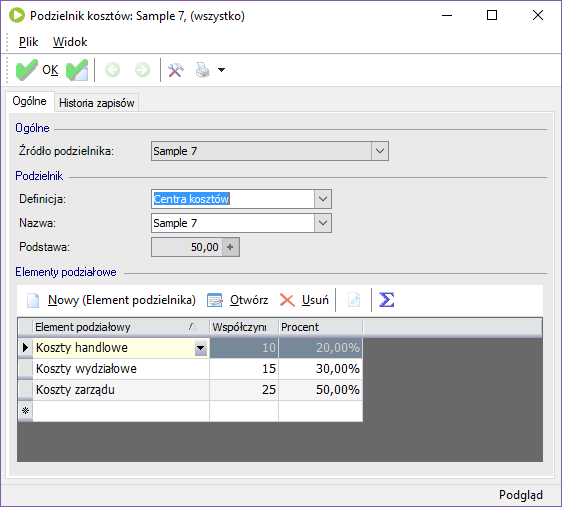

## Schematy podziałowe w enova365 dla programistów
### Sample A7

Schemat podziałowy dla ewidencji z wykorzystaniem podzielnika kosztów z centrami kosztów.

* włączona opcja: Podział elementu wg proporcji
* ilość opisów analitycznych określona przez podzielnik kosztów
* proporcje dla generowania kwoty określone przez podzielnik kosztów
* pozostałe właściwości opisu arbitralnie wpisane w schemacie

#### Konfiguracja

Przed uruchomieniem schematu należy skonfigurować podzielnik kosztów.

* tworzymy nowy zestaw podzielników kosztów o nazwie "Sample 7"
* w zestawie dodajemy podzielnik kosztów o nazwie "Sample 7" wg definicji "Centra kosztów"
* wg uznania dodajemy elementy podziałowe

W przykładzie wprowadzono następujące dane:

